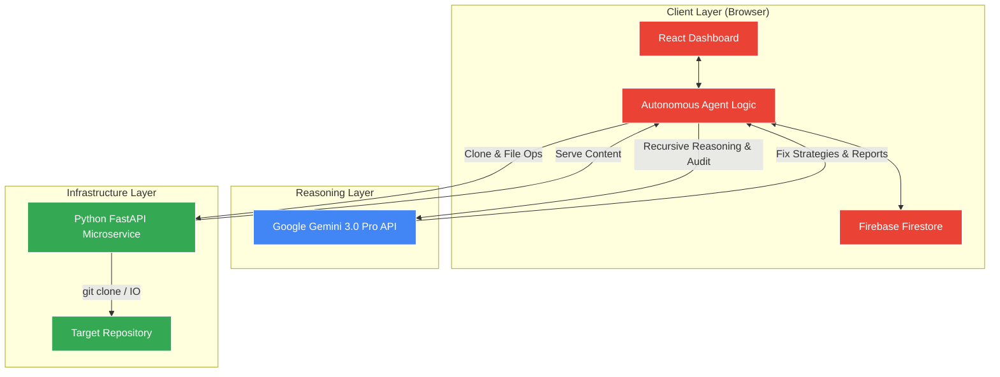

<div align="center">
  

  <h1>AutoDevOps AI</h1>
  <h3>Autonomous SRE & Self-Healing Codebase System</h3>

  <p>
    <strong>AutoDevOps AI</strong> is a next-generation autonomous agent built to audit, diagnose, and stabilize codebases without human intervention.
    Powered by <strong>Google Gemini 3.0</strong>, it acts as a virtual Site Reliability Engineer (SRE) that recursively reasons about system architecture, detects high-confidence vulnerabilities, and generates precise, verified fixes.
  </p>

  <p>
    <a href="#-architecture">Architecture</a> •
    <a href="#-tech-stack">Tech Stack</a> •
    <a href="#-features">Features</a> •
    <a href="#-getting-started">Getting Started</a> •
    <a href="./backend-simple/README.md">Backend Service</a>
  </p>
</div>

---

## 🏗 Architecture

AutoDevOps AI acts as an intelligent orchestrator that interfaces with your Git repositories. It uses a hybrid architecture: a **React-based Autonomous Agent** for reasoning and state management, and a **Lightweight Python Microservice** for secure file operations.



### Core Flow
1. **Ingest**: User provides a repository URL. The agent requests the backend to clone it securely to a temporary sandbox.
2. **Audit**: The agent traverses the file tree and sends high-level context to Gemini 3.0 to identify architectural weaknesses and bugs.
3. **Reason**: Implementing a "Thought Signature" system, the agent maintains a persistent chain of thought across multiple API calls, ensuring consistency.
4. **Stabilize**: For every detected issue, the agent generates a specific, minimal fix strategy, validates it, and prepares a stabilization patch.
5. **Verify**: A multi-path verification step ensures that fixes do not introduce regressions.

---

## ⚡ Tech Stack

### **Frontend (The Brain)**
- **React 19**: Utilizing the latest concurrent features for smooth agent state updates.
- **Vite**: Blazing fast build tool and dev server.
- **Google GenAI SDK**: Direct integration with Gemini 1.5/3.0 models for high-speed inference.
- **Firebase**: Firestore for persisting agent sessions, logs, and simulation history.
- **Tailwind CSS**: Rapid, utility-first styling for the mission control dashboard.

### **Backend (The Hands)**
- **FastAPI**: High-performance Python framework for handling Git operations asynchronously.
- **Microservice Architecture**: Stateless, container-ready design suitable for Cloud Run.
- **Git**: Native integration for cloning and managing repositories.

---

## 🚀 Features

- **🛡 Autonomous Auditing**: Scans codebases for security risks, performance bottlenecks, and anti-patterns without configuration.
- **🧠 Recursive Reasoning**: Doesn't just "guess." It maintains an internal monologue (Thought Signature) to rationalize its decisions similar to a human engineer.
- **🔧 Self-Healing**: Automatically generates precise code patches to fix detected issues.
- **📊 Live Mission Control**: Watch the agent "think" in real-time via a strictly typed event log dashboard.
- **🔒 Secure Sandboxing**: all code operations happen in isolated sessions that are automatically purged.

---

## 🏁 Getting Started

### Prerequisites
- **Node.js** (v18+)
- **Python** (v3.9+)
- **Google Gemini API Key**

### 1. Setup the Frontend (Agent)

```bash
# Install dependencies
npm install

# Configure Environment
# Create a .env.local file and add your keys:
echo "VITE_GEMINI_API_KEY=your_key_here" > .env.local
echo "VITE_FIREBASE_CONFIG=your_firebase_config_here" >> .env.local

# Run the Agent Dashboard
npm run dev
```

### 2. Run the Backend Service

```bash
cd backend-simple

# Install Python dependencies
pip install -r requirements.txt

# Start the Microservice
python main.py
```

The frontend will automatically discover the local backend at `http://localhost:8000`.

---

## 📜 License

Distributed under the MIT License. See `LICENSE` for more information.
